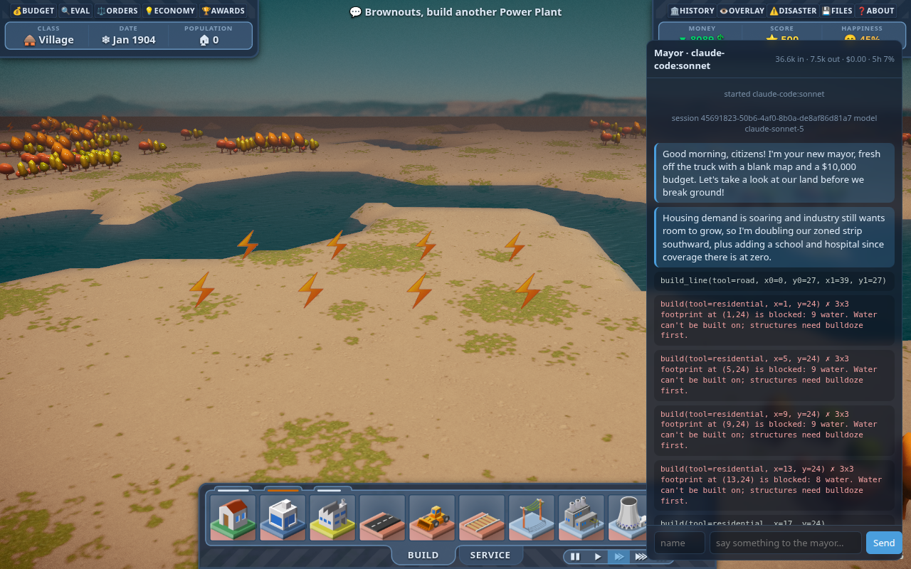

# llm-city-builder

> An LLM plays a 3D SimCity-style city builder. You watch, and you can heckle the mayor.

A fork of [lo-th/3d.city](https://github.com/lo-th/3d.city) (Three.js renderer + [micropolisJS](https://github.com/graememcc/micropolisJS) simulation). The simulation runs headless in Node; an AI agent plays it through a small tool API; browsers connect as viewers and get a chat panel with the mayor's narration, every tool call it makes, a message box, and a running token/cost ledger.



## How it works

```
browser viewers  ──WebSocket──▶  server/           ◀──MCP (http)──  claude -p  (Claude Code CLI)
 (3D render + chat panel)        ├─ sim.js      headless micropolis, single source of truth
                                 ├─ relay.js    snapshot on join, 20 Hz binary diff frames
                                 ├─ gameApi.js  build / build_line / bulldoze / get_map / say / wait …
                                 ├─ mcp.js      the same tools over MCP at /mcp
                                 ├─ agent.js    play loop, system prompt, transcript
                                 └─ ledger.js   tokens + cost
```

- The agent only acts through tools. `say(text)` is its narration channel; everything else is a game action and is echoed to viewers as it happens.
- Viewer messages are delivered to the agent inside its next tool result, so it can answer mid-turn.
- Many viewers are cheap: a late joiner gets one full snapshot (~65 KB), then diffs (~60 B/tick when idle).

## Run it

Requires Node 22+ and, for the default driver, the [Claude Code](https://code.claude.com) CLI (`claude`) logged in.

```bash
npm install
npm run build                                  # bundle src/ → build/ (rerun after touching src/)

node server/index.js                           # sim + viewers only  → http://localhost:8787/
AGENT=claude-code node server/index.js         # Claude Code plays, default model
AGENT=claude-code:sonnet node server/index.js  # pick a model alias / id
```

| env | meaning |
|---|---|
| `PORT` | http/ws port (default 8787) |
| `AGENT` | `claude-code[:model]` |
| `MAX_BUDGET_USD` | passed to `claude --max-budget-usd`; the mayor stops when it's spent |
| `AGENT_LOG` | file to append the CLI's raw stream-json events to |
| `DEMO=1` | scripted starter town, no agent |

`index.html` is still the original single-player game if you want to play yourself.

## The tool API

| tool | what it does |
|---|---|
| `get_state` | date, funds, population, RCI demand, taxes, zone counts |
| `get_map` | ASCII map: whole map downsampled, or a full-res window (max 64×64) |
| `get_evaluation` | approval, top problems, service coverage |
| `query x y` | inspect one tile |
| `build tool x y` | zones / buildings, top-left corner; explains what blocks a footprint |
| `build_line tool x0 y0 x1 y1` | road / rail / wire, straight or L-shaped |
| `bulldoze x y w h` | clear a rectangle |
| `set_speed`, `set_budget` | pace and taxes / funding |
| `say text` | talk to the viewers |
| `wait months` | let the sim run, then report |

The definitions live in `server/tools.js` (zod) and are served over MCP; a direct-API driver can reuse them as JSON schema.

## Token tracking

The panel header shows input / output tokens and cost. With Claude Code, per-call usage comes from the stream (`message_start` / `message_delta`); the CLI's authoritative `total_cost_usd` only arrives when the model ends a turn, so until then the cost is estimated from a price table and shown as `~$x`.

## Status / roadmap

- [x] Headless sim, relay, viewer mode
- [x] Tool API, MCP server, Claude Code driver, chat panel, ledger
- [ ] Direct Anthropic API driver, Codex driver
- [ ] Persistence, pause/resume, spend caps, map sizes, viewer-only HUD

See [docs/PLAN.md](docs/PLAN.md) for details and gotchas.

## License

The renderer and this fork's server code follow upstream 3d.city (MIT, see [LICENSE](LICENSE)). The simulation engine in `src/micro` is derived from micropolisJS, which is GPL‑3 — treat the combined work as GPL‑3.
